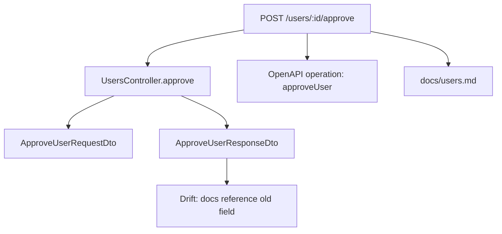

# Peria Roadmap

Last researched: 2026-06-23
Status: active roadmap after Phase 0 and Phase 1 completion.
Current focus: Phase 2 — NestJS adapter, followed by Fumadocs + Stoplight Elements docs/API reference integration.

## 1. Product Thesis

Peria is a local-first, source-backed knowledge layer for backend and API repositories.

It scans a repository, connects framework routes, handlers, schemas, OpenAPI descriptions, existing docs, Git changes, issues, pull requests, releases, and agent context files, then publishes that connected knowledge as:

* A human-readable technical wiki
* An API reference powered by OpenAPI
* Mermaid diagrams explaining system structure and flows
* Drift checks that verify whether documentation still matches code
* Agent-ready context packs for coding assistants
* Later, an MCP bridge over the same knowledge graph

The shortest positioning:

> Peria turns backend code, OpenAPI, docs, and Git history into a traceable knowledge graph served as `/docs` and exported as AI-ready context.

A sharper positioning:

> Peria is not an AI documentation generator. Peria is a source-backed evidence graph that documentation, checks, agents, and future MCP tools can consume.

## 2. Strategic Decision

Peria should not become another API reference UI, generic docs site, README generator, or AI wiki clone.

Those categories already have strong products:

* API reference UI: Scalar, Redocly, Stoplight Elements, Swagger UI, ReadMe
* Docs-as-code and developer portals: Docusaurus, VitePress, Backstage TechDocs
* Generated code wikis: DeepWiki, Google Code Wiki, Swimm-style system understanding
* API lifecycle platforms: Fern, Speakeasy, OpenAPI Generator
* Agent context conventions: llms.txt, AGENTS.md, CLAUDE.md, Cursor rules, MCP, Context7

Peria's wedge is narrower:

> A deterministic, local-first knowledge graph for backend/API repositories that proves what changed, what it affects, where it is documented, and what context an agent should read before editing it.

The product should win on traceability, not on prettier generated prose.

## 3. Market Reading

OpenAPI is the right contract layer, but not the full product. It gives Peria a reliable API surface to reconcile against code, docs, and generated references.

API reference rendering is crowded. Peria should embed or wrap an existing renderer first. The selected MVP direction is Stoplight Elements, embedded inside the Peria documentation experience, instead of rebuilding API reference UI from scratch.

Docs-as-code is proven, but generic. Peria should borrow the local Markdown/MDX model while using Fumadocs as the initial wiki renderer and adding route, schema, change, and source provenance.

AI code understanding is crowded and moving fast. Peria should avoid generic “summarize any repo” positioning and specialize in backend/API evidence, change impact, and agent context.

Documentation drift is the core pain. The `peria check` command should become the product’s trust anchor by failing with precise, actionable evidence.

Agent context is becoming a standard surface. llms.txt, AGENTS.md, CLAUDE.md, Cursor rules, and MCP all point in the same direction: agents need current, concise, source-backed context.

Developer trust in AI output remains limited. Peria should answer that with deterministic extraction, confidence levels, and links back to source.

## 4. Current Project State

This roadmap now treats Phase 0 and Phase 1 as completed.

Current completed foundation:

* The repository foundation has been cleaned enough to continue feature work.
* The roadmap now assumes the package foundation, config honesty, initial CI expectations, test structure, npm preparation, and self-documentation bootstrap from Phase 0 are done.
* The roadmap now assumes the core scanner, parser foundation, graph model, manifest serialization, evidence metadata, confidence metadata, and package representation from Phase 1 are done.
* The current product direction has changed from a generic docs UI plus Stoplight Elements-based API reference to a Fumadocs-based technical wiki with Stoplight Elements embedded for API reference.
* The next concrete product proof is no longer general scaffolding. It is a working NestJS adapter that extracts real backend/API structure into the Peria graph.

Current active focus:

1. Build the NestJS adapter deeply.
2. Use the completed graph foundation to extract routes, controllers, handlers, modules, DTOs, guards, pipes, interceptors, and source evidence.
3. Match extracted routes against OpenAPI operations.
4. Prepare the docs renderer around Fumadocs.
5. Embed Stoplight Elements as the built-in API Reference surface.
6. Keep Peria self-documented from this point forward.

Important assumptions:

* Phase 0 and Phase 1 are considered completed based on current project status.
* Exact branch, commit, package versions, and current test output should be refreshed from Git before publishing or announcing.
* Any feature not wired into the graph, CLI, docs renderer, or checks should remain clearly labeled experimental.
* The roadmap should no longer spend major time on generic package cleanup unless it blocks Phase 2 or release hardening.

Current risk:

> The product now needs to move from “credible foundation” to “visible proof”. The next milestone must show Peria extracting a real NestJS app and turning it into source-backed docs, API reference context, and drift signals.

## 5. Competitor Map

| Category      | Examples                                                    | What they own                                      | Peria opportunity                                                                |
| ------------- | ----------------------------------------------------------- | -------------------------------------------------- | -------------------------------------------------------------------------------- |
| OpenAPI UI    | Scalar, Redocly, Stoplight Elements, Swagger UI, ReadMe     | Interactive endpoint browsing and request examples | Embed or wrap. Add code, docs, and change provenance around operations.          |
| API lifecycle | Fern, Speakeasy, OpenAPI Generator                          | SDKs, clients, docs, spec workflows                | Stay repo-local and graph-focused. Do not start with SDK generation.             |
| Docs sites    | Fumadocs, Docusaurus, VitePress, Backstage TechDocs          | Markdown/MDX sites and developer portals           | Use Fumadocs as the initial renderer while generating source-backed wiki pages.   |
| Code wiki AI  | DeepWiki, Google Code Wiki, Swimm                           | Automatic architecture explanations and repo Q&A   | Win on deterministic backend/API extraction, drift checks, and traceable claims. |
| Agent context | llms.txt, AGENTS.md, CLAUDE.md, Cursor rules, Context7, MCP | Instructions and retrieval surfaces for agents     | Generate route, diff, and task context from the same graph.                      |
| Drift tools   | DocDrift-style checks, docs CI checklists                   | Detecting stale docs around code changes           | Tie drift to routes, schemas, OpenAPI operations, docs pages, and commits.       |

## 6. Product Principles

1. Humans first, agents second, same source of truth.

The wiki, API reference, context packs, drift checks, and future MCP server should all come from the same graph.

2. Deterministic before generative.

Peria should extract routes, schemas, docs, files, symbols, and changes deterministically before generating any prose.

3. Evidence over vibes.

Every important claim should point back to a file, route, schema, OpenAPI operation, commit, issue, PR, or docs page.

4. Local-first by default.

The open-source version should work locally without requiring Peria Cloud.

5. Integrate before rebuilding.

Peria should use proven tools where they already win: Fumadocs for the technical wiki shell, Stoplight Elements for API reference rendering, Mermaid for diagrams, Markdown/MDX for content, and Git for change data.

6. Drift checks are the trust anchor.

The product becomes valuable when `peria check` can prove that docs, routes, schemas, and OpenAPI are aligned or out of sync.

7. Agent context must be small and useful.

Generated agent context should be task-oriented, scoped, and source-backed. It should not dump the whole repo.

8. Backend/API specialization is a feature.

Peria should not attempt to understand every kind of software equally well in the MVP. The first version should focus on backend and API repositories.

9. The manifest is a product surface.

The `.peria/manifest.json` file should be treated as a stable, versioned contract consumed by the docs UI, CLI, CI, agent context packs, MCP server, and future cloud features.

10. UI should clarify evidence, not hide it.

The `/docs` surface should make source links, confidence, drift status, and affected files visible by default.

11. Peria must dogfood itself.

The Peria repository should be documented, checked, visualized, and prepared for agents using Peria itself.

12. Public distribution is part of the MVP.

Peria should be installable from npm early, even if the first release is experimental. A local-first developer tool needs a simple install path.

## 7. Non-goals for the MVP

Peria should remain narrow in the MVP.

Peria will not, in the MVP:

* Replace Scalar, Swagger UI, Redocly, or Stoplight Elements
* Generate SDKs
* Become a generic chat interface over repositories
* Become a generic documentation site builder
* Fully replace Docusaurus, VitePress, Backstage, or ReadMe
* Document complex frontend applications
* Require Peria Cloud
* Require LLMs for route extraction, schema extraction, or drift checks
* Upload repository code by default
* Support every backend framework equally
* Build a complete plugin ecosystem before the core graph is proven
* Implement a full MCP server before the manifest and graph are stable

The MVP should prove one thing well:

> Peria can scan backend code, connect it to OpenAPI and docs, serve that knowledge locally, and detect drift with evidence.

## 8. Self-Documentation Requirement

Peria must use Peria to document Peria.

The project should dogfood its own knowledge graph, docs UI, drift checks, Mermaid diagrams, package/module documentation, and agent context packs as early as possible.

This means the Peria repository itself should have:

* `.peria/manifest.json` generated by Peria
* `/docs` powered by Peria
* Package/module documentation generated or connected by Peria
* Mermaid diagrams generated from the Peria graph
* Drift checks running against its own docs
* Agent context packs generated for contributors
* llms.txt, AGENTS.md, and CLAUDE.md generated or validated by Peria

This is not only a technical requirement. It is a product credibility requirement.

The public repository should prove that Peria is useful by using Peria on itself.

Dogfooding rule:

> If Peria claims it can keep backend/API knowledge connected, the Peria repository must be the first proof.

MVP acceptance criteria:

* Running `peria scan` on the Peria repo produces a valid manifest.
* Running `peria docs` serves Peria’s own technical wiki.
* Running `peria check` validates Peria’s own docs, manifest, diagrams, and agent context.
* The README links to Peria-generated documentation.
* Contributors can use Peria-generated context packs before editing the codebase.

This requirement should be included in Phase 0 and remain active across every phase of the roadmap.

## 9. npm Registry Requirement

Peria should be registered and published on npm as part of the MVP foundation.

The goal is not only distribution. The npm package is part of the product’s credibility and adoption path.

Public install should work as early as possible:

```sh id="qxdcgt"
npm install -D peria
```

or, if the unscoped package name is unavailable:

```sh id="kxksch"
npm install -D @peria/cli
```

Recommended strategy:

1. Try to reserve/publish the unscoped `peria` package if available.
2. Also create or reserve the `@peria` npm organization/scope if possible.
3. Publish the monorepo packages under `@peria/*`.
4. Keep the user-facing CLI install simple.
5. Avoid publishing packages that are stubs without clear experimental labeling.

Suggested package naming:

| Package           | Purpose                                           |
| ----------------- | ------------------------------------------------- |
| `peria`           | Preferred user-facing CLI package if available    |
| `@peria/cli`      | CLI package                                       |
| `@peria/core`     | Graph, config, parsers, manifest, drift engine    |
| `@peria/adapters` | Framework adapters                                |
| `@peria/sdk`      | Embedded server and framework integration helpers |
| `@peria/docs-ui`  | Shared docs UI components if kept                |
| `@peria/renderer-fumadocs` | Fumadocs renderer adapter              |
| `@peria/api-ref-stoplight` | Stoplight Elements API reference adapter |
| `@peria/types`    | Shared public types if needed later               |

Initial CLI usage should be possible through:

```sh id="s99w6e"
npx peria init
npx peria scan
npx peria docs
npx peria check
```

or:

```sh id="wrdxr4"
bunx peria init
pnpm dlx peria init
```

If scoped-only distribution is used:

```sh id="d5xtp3"
npx @peria/cli init
pnpm dlx @peria/cli init
bunx @peria/cli init
```

The package should not be published as stable until the core commands are honest.

Minimum npm release requirements:

* Package builds successfully.
* Package exports resolve correctly.
* CLI binary works after install.
* `peria --help` works.
* `peria init` works at least as a functional wizard.
* `peria scan` produces a manifest.
* `peria check` returns meaningful diagnostics.
* README explains current feature status accurately.
* Package contents are reviewed before publishing.
* No secrets, local manifests with private paths, tokens, test credentials, or unnecessary files are included.
* Version starts below `1.0.0`, preferably `0.1.0` or `0.0.x`.
* Experimental status is clear.

Recommended npm package metadata:

```json id="qk6fpa"
{
  "name": "peria",
  "version": "0.1.0",
  "description": "Local-first source-backed knowledge graph for backend and API repositories.",
  "bin": {
    "peria": "dist/bin/peria.js"
  },
  "type": "module",
  "license": "MIT",
  "keywords": [
    "docs",
    "openapi",
    "backend",
    "api",
    "knowledge-graph",
    "documentation",
    "drift",
    "agents",
    "llms-txt",
    "mcp",
    "nestjs",
    "express"
  ],
  "files": [
    "dist",
    "README.md",
    "LICENSE",
    "package.json"
  ]
}
```

Release principle:

> npm distribution should be early, but honest. Users should never install Peria and discover that the main claims are only placeholders.

## 10. Trust Model

Peria should formalize trust at the graph level.

Every important relationship should carry:

* `source`: file, line, commit, OpenAPI pointer, docs page, or Git reference
* `confidence`: `high`, `medium`, or `low`
* `extraction_method`: `ast`, `openapi`, `markdown`, `git`, `heuristic`, `llm`, or `manual`
* `reason`: why this relationship exists
* `last_verified_at`: when Peria last confirmed the relation
* `stale`: whether the relation appears outdated

Example:

```json id="v558ex"
{
  "type": "route_handler_relation",
  "route": "POST /users/:id/approve",
  "handler": "UsersController.approve",
  "source": {
    "file": "src/users/users.controller.ts",
    "line": 42
  },
  "confidence": "high",
  "extraction_method": "ast",
  "reason": "NestJS @Post(':id/approve') decorator found on UsersController.approve",
  "last_verified_at": "2026-06-23T00:00:00.000Z",
  "stale": false
}
```

Confidence rules:

| Confidence | Meaning                                               | Example                                                        |
| ---------- | ----------------------------------------------------- | -------------------------------------------------------------- |
| `high`     | Deterministic extraction from source, OpenAPI, or Git | AST route extraction, OpenAPI path match                       |
| `medium`   | Strong heuristic, but not fully guaranteed            | Markdown page likely documents a route based on title/path     |
| `low`      | Weak relation or generated inference                  | LLM-generated architecture summary without direct symbol match |

LLM-generated claims should never be treated as `high` confidence unless backed by deterministic evidence.

This is one of Peria’s core differentiators.

## 11. Manifest Contract

`.peria/manifest.json` is the portable output of Peria.

It should be:

* Deterministic
* Versioned
* Stable enough for external tools
* Readable by humans
* Usable by CI
* Usable by agents
* Usable by the future MCP server
* Usable by Peria Cloud without changing the OSS architecture

Initial shape:

```json id="fvvbri"
{
  "manifestVersion": "0.1.0",
  "periaVersion": "0.1.0",
  "generatedAt": "2026-06-23T00:00:00.000Z",
  "repo": {
    "name": "example-api",
    "root": ".",
    "commit": "cc40d72",
    "branch": "feat/self-documentation-bootstrap"
  },
  "framework": {
    "name": "nestjs",
    "confidence": "high",
    "entrypoint": "src/main.ts"
  },
  "routes": [],
  "schemas": [],
  "openapi": [],
  "docs": [],
  "diagrams": [],
  "agentContext": [],
  "git": {
    "lastCommit": "cc40d72",
    "dirty": false
  },
  "drift": []
}
```

The manifest should be treated as a public internal API.

Breaking changes should require a manifest version bump.

## 12. Core Graph Model

Peria should define a small, durable graph model before expanding features.

Initial graph entities:

* `Project`
* `SourceFile`
* `Framework`
* `Entrypoint`
* `Package`
* `Module`
* `Route`
* `Handler`
* `Middleware`
* `Guard`
* `Interceptor`
* `Pipe`
* `Schema`
* `OpenAPIOperation`
* `DocPage`
* `DocSection`
* `MermaidDiagram`
* `AgentContextFile`
* `NpmPackage`
* `GitChange`
* `DriftFinding`

Initial relation types:

* `route_implemented_by_handler`
* `route_documented_by_doc_page`
* `route_described_by_openapi_operation`
* `handler_uses_schema`
* `schema_described_by_openapi_schema`
* `doc_page_references_route`
* `doc_page_references_schema`
* `package_exports_symbol`
* `package_contains_module`
* `git_change_impacts_route`
* `git_change_impacts_schema`
* `git_change_impacts_doc_page`
* `diagram_represents_route`
* `agent_context_includes_route`
* `drift_finding_affects_entity`

This graph does not need to be complex at first. It needs to be correct, inspectable, and stable.

## 13. Framework Adapter Contract

Adapters should be easy to understand and contribute to.

The adapter contract should be explicit:

```ts id="hwdivt"
export interface FrameworkAdapter {
  name: string

  detect(context: RepoContext): Promise<FrameworkDetectionResult>

  extractRoutes(context: RepoContext): Promise<RouteEntity[]>

  extractSchemas?(context: RepoContext): Promise<SchemaEntity[]>

  extractMiddleware?(context: RepoContext): Promise<MiddlewareEntity[]>

  extractModules?(context: RepoContext): Promise<ModuleEntity[]>

  extractEntrypoints?(context: RepoContext): Promise<EntrypointEntity[]>
}
```

Suggested result shape:

```ts id="r0t60u"
export interface FrameworkDetectionResult {
  framework: "nestjs" | "express" | "fastify" | "hono" | "elysia" | "unknown"
  confidence: "high" | "medium" | "low"
  reasons: string[]
  suggestedEntrypoints: string[]
}
```

Adapter implementation order:

1. NestJS
2. Express
3. Fastify
4. Hono
5. Elysia

MVP rule:

> Build one adapter deeply before building five adapters superficially.

NestJS should be the first serious adapter because it has explicit controller patterns, decorators, DTOs, modules, guards, pipes, and OpenAPI conventions.

## 14. MVP Definition

The open-source MVP should prove one thing:

> Peria can scan a backend repository, build a source-backed graph of routes, schemas, docs, and OpenAPI operations, then serve that graph as `/docs` and validate it with `peria check`.

The MVP should include:

* `peria init`
* Repository scanner
* Config file generation
* Framework detection
* NestJS adapter first
* Express/Fastify adapter second
* OpenAPI ingestion
* Markdown docs ingestion
* Basic knowledge graph
* Manifest generation
* Embedded `/docs` server
* Fumadocs-based technical wiki renderer
* Stoplight Elements-based API reference
* Mermaid diagram generation and viewing
* `peria check`
* Basic drift report
* Agent context pack generation
* Self-documentation of the Peria repository
* npm package registration and experimental public release
* Real tests for parsers, graph, CLI, and adapters

The MVP should not include:

* SDK generation
* Hosted Peria Cloud
* Full MCP server
* Multi-repo knowledge graph
* Deep AI chat over the repo
* Advanced PR review automation
* Enterprise permissions
* Generic frontend app documentation
* Full replacement for Docusaurus, VitePress, or Backstage

## 15. Recommended MVP Flow

### `peria init`

The init command should open a wizard.

It should:

1. Scan the repository.
2. Detect likely framework candidates: NestJS, Express, Fastify, Hono, Elysia, or unknown.
3. Ask the user to confirm the framework.
4. Detect likely entry files such as `main.ts`, `server.ts`, `app.ts`, or equivalent.
5. Ask the user to confirm the entry file.
6. Ask where docs should be served. Default: `/docs`.
7. Ask which features to enable:

   * Embedded docs
   * API reference
   * Mermaid diagrams
   * Drift checks
   * Agent context packs
   * llms.txt generation
8. Show a final confirmation summary.
9. Install or configure the needed package for npm, pnpm, yarn, or bun.
10. Generate `peria.config.ts`.
11. Generate the initial `.peria/manifest.json`.

### `peria scan`

Builds the local knowledge graph.

It should extract:

* Routes
* HTTP methods
* Controllers or handlers
* Request schemas
* Response schemas
* Middleware/guards/interceptors when detectable
* OpenAPI operations
* Existing Markdown/MDX docs
* llms.txt
* AGENTS.md
* CLAUDE.md
* Cursor rules
* Mermaid blocks
* Git metadata
* Package exports and package boundaries where useful

### `peria docs`

Starts or builds the local documentation surface.

It should provide:

* Technical wiki
* API reference
* Route-to-source links
* Docs-to-route links
* Mermaid diagrams
* Source evidence panels
* Generated context packs
* Drift report
* Manifest inspector

### `peria check`

Validates that the knowledge graph is still accurate.

It should detect:

* Route exists in code but not in OpenAPI
* OpenAPI operation exists but route is missing in code
* Route exists but has no docs page
* Docs mention a route that no longer exists
* Schema changed but docs did not
* Changed files impact docs that were not updated
* Stale `.peria/manifest.json`
* Missing or stale agent context files
* Stale self-documentation in the Peria repository
* Package exports that do not match built output

The output should be precise and actionable.

Example:

```txt id="z65xgb"
DRIFT: POST /users/:id/approve

Code:
  packages/api/src/users/users.controller.ts:42

OpenAPI:
  Missing operation

Docs:
  docs/users.md references old response field: approvedAt

Suggested action:
  Update OpenAPI operation and docs/users.md.
```

## 16. Docs UI Direction

The generated `/docs` should feel like a modern technical wiki, closer to a Stripe-like developer documentation experience than a generic generated README.

The selected MVP UI direction is:

```txt
Fumadocs = documentation shell, navigation, MDX, layout, search surface, and visual wiki foundation
Stoplight Elements = embedded API Reference renderer
Peria UI components = evidence, drift, graph, source links, Mermaid, agent context, and manifest inspection
```

Peria should not become structurally dependent on Fumadocs or Stoplight Elements.

They are renderer adapters:

```txt
@peria/renderer-fumadocs
@peria/api-ref-stoplight
@peria/ui
```

The visual direction should be:

* Clean
* Dense but readable
* Fast
* Source-backed
* Developer-native
* Local-first
* Searchable
* Keyboard-friendly
* Good in dark and light mode
* Strong typography
* Clear side navigation
* Evidence visible near every claim

It should not feel like:

* A blog
* A marketing docs site
* A generic AI-generated wiki
* A Swagger UI clone
* A raw static Markdown dump

Core UI idea:

> A Fumadocs-powered technical wiki where every page can connect code, API, diagram, source evidence, drift status, and agent context.

The docs renderer should make Peria’s graph visible, not hide it behind generated prose.

## 17. Docs UI Information Architecture

The Fumadocs-powered `/docs` surface should include:

* Overview
* API Reference
* Routes
* Schemas
* Modules
* Packages
* Docs Pages
* Diagrams
* Drift Report
* Agent Context
* Source Evidence
* Manifest Inspector

Suggested navigation:

```txt id="fpkm5r"
/docs
  Overview
  API Reference
  Routes
    GET /users
    POST /users
    POST /users/:id/approve
  Modules
    UsersModule
    AuthModule
    BillingModule
  Packages
    @peria/core
    @peria/cli
    @peria/adapters
    @peria/sdk
    @peria/docs-ui
  Schemas
    UserDto
    CreateUserDto
    ApproveUserResponseDto
  Diagrams
    Module Map
    Request Flow
    Auth Flow
  Drift
    Current Findings
    Changed Since Last Scan
  Agent Context
    llms.txt
    AGENTS.md
    CLAUDE.md
    Route Packs
  Manifest
    Graph
    Raw JSON
```

The most important page is the route detail page.

Example route page:

```txt id="e9hb1u"
POST /users/:id/approve

Handler:
  UsersController.approve

Source:
  src/users/users.controller.ts:42

OpenAPI:
  operationId: approveUser

Docs:
  docs/users.md

Schemas:
  ApproveUserRequestDto
  ApproveUserResponseDto

Last changed:
  commit abc123

Confidence:
  high

Drift:
  Response schema changed, docs not updated.
```

For Peria’s own repository, the package detail page is also important.

Example package page:

```txt id="j0dscq"
@peria/core

Purpose:
  Core graph, config, parsers, manifest, and drift engine.

Exports:
  ./index
  ./config
  ./detectors

Source:
  packages/core/src

Build output:
  packages/core/dist

Drift:
  package.json exposes ./config, but dist/config.js is missing.

Agent context:
  .peria/context/packages/core.md
```

## 18. Stripe-like Wiki Visual System

The UI should take inspiration from the clarity of modern API documentation products without copying any specific product. Fumadocs should provide the shell; Peria should provide the graph-aware components.

Suggested layout:

```txt id="lwgo9r"
┌──────────────────────────────────────────────────────────────┐
│ Top bar: Project / Search / Branch / Drift status / Theme    │
├───────────────┬──────────────────────────────┬───────────────┤
│ Sidebar       │ Main content                  │ Evidence rail  │
│               │                               │               │
│ Overview      │ POST /users/:id/approve       │ Source         │
│ API Reference │ Route summary                 │ OpenAPI        │
│ Routes        │ Code blocks                   │ Docs           │
│ Schemas       │ Mermaid viewer                │ Git            │
│ Diagrams      │ Related schemas               │ Confidence     │
│ Drift         │ Agent context preview         │ Drift          │
└───────────────┴──────────────────────────────┴───────────────┘
```

Recommended components:

* Persistent left sidebar
* Sticky right evidence rail
* Command menu search
* Route cards
* Package cards
* Schema cards
* Drift badges
* Confidence badges
* Source file chips
* Copyable code blocks
* Mermaid viewer
* API operation viewer
* Manifest JSON inspector
* “Open in editor” links when possible
* “Copy agent context” actions
* “Run check again” action in local dev mode

Visual tokens:

```txt id="xsgbr6"
Background:
  neutral, low-noise, docs-like

Typography:
  strong headings
  readable body
  compact monospace for code and evidence

Cards:
  subtle borders
  rounded but not playful
  clear spacing
  source-backed metadata rows

Status:
  green = aligned
  yellow = warning
  red = drift
  gray = unknown / not scanned

Density:
  more Stripe docs than marketing landing page
```

The product should feel professional, not decorative.

## 19. Docs UI Core Components

### Route Card

```txt id="a5t8wq"
POST /users/:id/approve
Approve a user request.

Handler:
  UsersController.approve

OpenAPI:
  approveUser

Docs:
  docs/users.md

Status:
  Drift warning

Confidence:
  High
```

### Evidence Panel

```txt id="m95mvf"
Evidence

Code:
  src/users/users.controller.ts:42

OpenAPI:
  openapi.yaml#/paths/~1users~1{id}~1approve/post

Docs:
  docs/users.md#approve-user

Git:
  Last changed in abc123

Extraction:
  ast

Confidence:
  high
```

### Drift Finding Card

```txt id="nhs76e"
Schema drift detected

Route:
  POST /users/:id/approve

Changed:
  ApproveUserResponseDto

Problem:
  docs/users.md still references approvedAt, but response schema now uses approved_at.

Suggested action:
  Update docs/users.md and OpenAPI response schema.
```

### Agent Context Card

```txt id="yx39ex"
Agent context for this route

Includes:
  - Route handler
  - DTOs
  - Related docs
  - OpenAPI operation
  - Known drift findings
  - Recent Git changes

Actions:
  - Copy context
  - Export as Markdown
  - Save to .peria/context/users-approve.md
```

### Package Card

```txt id="pmq4z6"
@peria/core

Purpose:
  Graph, parser, config, manifest, and drift foundation.

Exports:
  ./index
  ./config
  ./detectors

Status:
  Export drift warning

Confidence:
  High
```

## 20. Mermaid Viewer

Mermaid should be a first-class visual surface, not only a Markdown feature.

Peria should support:

* Rendering existing Mermaid blocks found in docs
* Generating diagrams from graph data
* Showing the source data behind generated diagrams
* Allowing diagram copy/export
* Showing confidence level for generated diagrams
* Highlighting stale diagrams when graph data changes

Initial diagram types:

* Route map
* Module map
* Package map
* Request flow
* Endpoint-to-handler flow
* Schema dependency map
* Docs coverage map
* Drift impact map

Example generated Mermaid:



Peria self-documentation package map:

```mermaid id="a2y0o2"
flowchart TD
  CLI[@peria/cli] --> CORE[@peria/core]
  ADAPTERS[@peria/adapters] --> CORE
  SDK[@peria/sdk] --> CORE
  DOCSUI[@peria/docs-ui] --> CORE
  CLI --> ADAPTERS
  SDK --> DOCSUI
```

Mermaid viewer UI:

```txt id="x9v58r"
┌────────────────────────────────────────────┐
│ Request Flow                               │
│ Confidence: high                           │
│ Source: graph/routes/users-approve         │
├────────────────────────────────────────────┤
│                                            │
│            rendered diagram                │
│                                            │
├────────────────────────────────────────────┤
│ [View Mermaid] [Copy] [Export SVG]         │
└────────────────────────────────────────────┘
```

Generated diagrams should be marked clearly:

```txt id="g5fvo8"
Generated by Peria from manifestVersion 0.1.0.
Confidence: high.
Sources: route graph, OpenAPI operation, docs references.
```

## 21. Code Blocks and Source Viewer

Code blocks should be treated as interactive documentation elements.

Required behavior:

* Syntax highlighting
* Copy button
* File path label
* Line number support
* Highlighted relevant lines
* Source confidence
* Optional “open in editor” link
* Collapsible long snippets

Example:

```ts id="xx8skm"
// src/users/users.controller.ts:40-48

@Post(":id/approve")
approve(@Param("id") id: string, @Body() body: ApproveUserRequestDto) {
  return this.usersService.approve(id, body)
}
```

UI label:

```txt id="wloexw"
Source: src/users/users.controller.ts:40-48
Extracted by: ast
Confidence: high
```

The docs should not show generated prose without nearby source evidence.

## 22. API Reference Integration

Peria should not build an API reference renderer from scratch.

The selected MVP strategy is:

```txt
Fumadocs = docs/wiki shell
Stoplight Elements = embedded API Reference renderer
Peria = graph, provenance, drift, source links, and agent context
```

Stoplight Elements should be used as an embedded renderer inside the Peria docs UI, not as the owner of the entire navigation model.

Peria should own:

* `/docs` routing
* Main sidebar
* Search strategy
* Route pages
* Package pages
* Evidence rail
* Drift report
* Manifest inspector
* Agent context pages
* OpenAPI-to-code matching
* Version/multi-spec strategy later

Stoplight Elements should own:

* OpenAPI operation rendering
* Request/response display
* Schema display
* API console behavior where safe and configured
* Code samples where supported
* Three-column or stacked API reference layout

Peria’s API reference value is not rendering OpenAPI.

The value is showing:

* Source handler
* Related schemas
* Related docs
* Drift status
* Last changed commit
* Agent context pack
* Confidence
* Missing or stale relationships

OpenAPI should be enriched with Peria metadata where useful:

```json
{
  "paths": {
    "/users/{id}/approve": {
      "post": {
        "operationId": "approveUser",
        "x-peria": {
          "handler": "UsersController.approve",
          "source": {
            "file": "src/users/users.controller.ts",
            "line": 42
          },
          "module": "UsersModule",
          "docs": ["docs/users.md"],
          "schemas": [
            "ApproveUserRequestDto",
            "ApproveUserResponseDto"
          ],
          "drift": "warning",
          "confidence": "high"
        }
      }
    }
  }
}
```

Example operation context:

```txt
POST /users/:id/approve

OpenAPI:
  operationId: approveUser

Implemented by:
  UsersController.approve

Documented in:
  docs/users.md

Related schemas:
  ApproveUserRequestDto
  ApproveUserResponseDto

Rendered by:
  Stoplight Elements

Peria evidence:
  src/users/users.controller.ts:42
  extraction_method: ast
  confidence: high

Drift:
  OpenAPI response schema missing field approved_at.
```

Implementation rule:

> Stoplight Elements renders the API. Peria explains whether the API reference still matches the code.

## 23. Roadmap

Current roadmap status:

```txt
Phase 0 — Complete
Phase 1 — Complete
Phase 2 — Complete
Phase 3 — Complete
Phase 4 — Active next phase
```

The roadmap should now prioritize visible product proof over foundation work.

### Phase 0 — Package foundation and self-documentation bootstrap

Status: complete.

Original goal:

> Make the repo honest, buildable, self-documenting, and publishable.

Completed scope:

* Package foundation cleaned enough to support feature work.
* Package exports and config assumptions aligned with the actual MVP direction.
* Unimplemented claims clarified or reduced.
* Initial self-documentation bootstrap treated as part of the product, not a side task.
* npm package preparation included in the product foundation.
* CLI baseline established.
* CI/test/build expectations established.

Phase 0 is no longer an active roadmap phase.

Ongoing rule:

> Every future feature must keep the repository honest: no public claim should exist without a working CLI, graph, docs, check, or clearly marked experimental status.

### Phase 1 — Core graph and parser foundation

Status: complete.

Original goal:

> Build the minimum useful graph.

Completed scope assumed by this roadmap:

* Repository scanner foundation.
* Markdown parser foundation.
* OpenAPI parser foundation.
* llms.txt reader foundation.
* Package/export scanner foundation.
* Core graph entities.
* Stable manifest serialization into `.peria/manifest.json`.
* Source, confidence, extraction method, and reason metadata on graph relationships.
* Representation of Peria’s own monorepo packages in the graph.

Phase 1 is no longer an active roadmap phase.

Ongoing rule:

> The graph remains the source of truth. Fumadocs, Stoplight Elements, Mermaid, drift checks, agent context packs, and future MCP tools must consume the same graph.

### Phase 2 — NestJS adapter

Status: complete.

Goal:

> Prove the backend/API wedge with one serious framework.

Completed scope:

* Detect NestJS apps with high confidence.
* Locate and confirm `main.ts`.
* Extract controllers.
* Extract route paths and HTTP methods.
* Link routes to controller methods.
* Extract controller class, method name, decorators, and source location.
* Detect DTO/schema files where possible.
* Detect modules at a basic level.
* Detect guards, pipes, and interceptors at a basic level.
* Support common controller-level and method-level path composition.
* Support common decorator patterns (all standard NestJS decorators).
* Fixture NestJS app added for tests.
* Tests cover common NestJS controller patterns.
* Scanner integrates NestJS adapter for route extraction.

Phase 2 is no longer an active roadmap phase.

### Phase 3 — OpenAPI matching and Stoplight Elements integration

Status: complete.

Goal:

> Connect extracted routes to OpenAPI and render API Reference without rebuilding API docs from scratch.

Completed scope:

* OpenAPI matching engine (`packages/core/src/matcher/openapi-matcher.ts`).
* Route-to-operation matching with exact, operationId, and fuzzy matching.
* Unmatched routes and operations detection.
* Enriched OpenAPI generator (`packages/core/src/generators/enriched-openapi.ts`).
* Generates `.peria/openapi.enriched.json` with `x-peria` metadata.
* `@peria/api-ref-stoplight` package created with Stoplight Elements wrapper.
* `StoplightRenderer`, `OperationContext`, `DriftIndicator`, and `APIReferencePage` components.
* React component library with TypeScript declarations.
* SDK integration for mounting API reference.
* `generateAPIReferenceHTML()` for Stoplight Elements rendering.
* Config updated: `apiReference: true` by default.
* Scanner integrates matching and enrichment.
* Tests for matcher (`packages/core/src/__tests__/matcher/openapi-matcher.test.ts`).
* Fixture NestJS app with OpenAPI (`packages/core/fixtures/nestjs-api/`).

Exit criteria met:

* Routes link to OpenAPI operations with confidence levels.
* Unmatched routes/operations detected and flagged in warnings.
* Enriched OpenAPI generated to `.peria/openapi.enriched.json`.
* `apiReference` feature flag enabled by default.
* Matcher tests pass (10 tests).
* Stoplight Elements package builds successfully.

Phase 3 is no longer an active roadmap phase.

### Phase 4 — Fumadocs renderer and embedded docs server

Status: active next phase.

Goal:

> Make `/docs` real through a Fumadocs-powered technical wiki.

Priorities:

* Create `@peria/renderer-fumadocs`.
* Create or formalize `@peria/ui` for graph-aware components.
* Implement `packages/sdk/src/server/embed.ts`.
* Provide framework-specific embed adapters.
* Start with NestJS and Express.
* Serve the generated docs UI.
* Support configurable path, defaulting to `/docs`.
* Support static export as a fallback.
* Generate Fumadocs-compatible content from the Peria manifest.
* Include route pages, package pages, evidence rail, Mermaid viewer, code blocks, and drift cards.
* Embed Stoplight Elements on the API Reference page.
* Keep renderer output local-first.

Exit criteria:

* A user can add Peria to a backend app and access `/docs`.
* The docs surface includes wiki, API reference, diagrams, and evidence links.
* Route detail pages show source, docs, schemas, OpenAPI, drift, and agent context.
* Fumadocs handles the docs shell while Peria components handle graph-specific UI.
* The Peria repo itself can serve or export Peria-generated docs.

### Phase 5 — Drift checks

Goal:

> Make `peria check` the trust anchor.

Priorities:

* Compare code routes against OpenAPI.
* Compare docs references against existing routes.
* Compare manifest against current repo state.
* Compare package exports against build output.
* Detect Git diff impact.
* Detect stale Fumadocs pages generated from old manifest data.
* Detect stale enriched OpenAPI metadata.
* Generate actionable CLI output.
* Return non-zero exit codes for CI.
* Add severity levels:

  * `error`
  * `warning`
  * `info`

* Add machine-readable output:

  * JSON
  * GitHub Actions annotation format later

Exit criteria:

* `peria check` catches real drift in fixture repos.
* CI can fail when docs/spec/code drift is detected.
* Output tells users exactly what to update.
* Peria can detect drift in its own docs, manifest, package exports, and agent context.
* API reference drift is reported as Peria evidence, not as a Stoplight rendering concern.

### Phase 6 — Agent context packs

Goal:

> Make the graph useful for coding agents.

Priorities:

* Generate `.peria/context`.
* Generate route-specific context.
* Generate package-specific context.
* Generate diff-specific context.
* Generate task-oriented context packs.
* Generate or update llms.txt.
* Generate AGENTS.md and CLAUDE.md suggestions.
* Keep packs concise and source-backed.
* Include known drift findings.
* Include confidence and evidence metadata.
* Add “copy agent context” actions to the Fumadocs UI.

Exit criteria:

* A coding agent can read a small generated context pack before editing a route or package.
* Context includes source files, docs, schemas, OpenAPI operation, and known drift.
* Context does not dump the whole repo.
* Peria contributors can use generated context packs before editing Peria itself.

### Phase 7 — Mermaid diagrams

Goal:

> Make system understanding visual without pretending to be a full architecture tool.

Priorities:

* Preserve existing Mermaid blocks.
* Generate basic route/module/package diagrams.
* Generate endpoint-to-handler flow diagrams.
* Generate dependency diagrams where confidence is high.
* Add a Mermaid viewer to the Fumadocs UI.
* Mark generated diagrams with confidence and source evidence.
* Mark stale diagrams when graph data changes.
* Link diagrams to related routes, handlers, packages, and drift findings.

Exit criteria:

* Docs include useful diagrams for backend structure.
* Diagrams are generated from graph data, not vague summaries.
* Users can inspect the source evidence behind each generated diagram.
* Peria’s own package/module graph is rendered in its generated docs.

### Phase 8 — Docs UI polish

Goal:

> Make the local docs experience good enough to demo publicly.

Priorities:

* Polish the Fumadocs-based technical wiki layout.
* Add command menu search.
* Add route cards.
* Add package cards.
* Add sticky evidence rail.
* Add copyable code blocks.
* Add Mermaid viewer.
* Add drift report page.
* Add manifest inspector.
* Add agent context preview.
* Add Stoplight Elements theme alignment.
* Support dark and light mode.
* Keep UI fast and local.

Exit criteria:

* The generated `/docs` looks credible in a public demo.
* Users can navigate from route to source to docs to OpenAPI to drift finding.
* Users can navigate from package to exports to source to build output.
* The UI makes Peria’s differentiation obvious without explanation.
* Stoplight Elements feels embedded into Peria, not pasted into the page.

### Phase 9 — npm hardening and release workflow

Goal:

> Make Peria easy and safe to install.

Priorities:

* Define npm package ownership.
* Publish experimental packages.
* Validate installation through npm, pnpm, bun, and yarn.
* Add `prepublishOnly` checks.
* Add package provenance later if using GitHub Actions.
* Add release notes.
* Add changelog generation.
* Add smoke tests against installed packages.
* Avoid publishing unbuilt source or private development files.
* Ensure CLI works from published package, not only from monorepo source.
* Verify Fumadocs renderer package output.
* Verify Stoplight integration package output.

Exit criteria:

* `npx peria --help` works.
* `npx peria init` works.
* `npx peria scan` works.
* `npx peria docs` works.
* `npx peria check` works.
* `npm install -D peria` or `npm install -D @peria/cli` works.
* Published package contains only intended files.
* README install instructions match the published package.
* A new contributor can install and run Peria without cloning the repo.

## 24. Testing Strategy

Peria needs tests early because the product depends on trust.

Minimum test areas:

* Config loading
* Framework detection
* Markdown parsing
* OpenAPI parsing
* llms.txt parsing
* Graph serialization
* Manifest versioning
* Confidence metadata
* Package/export scanning
* NestJS route extraction
* Drift detection
* CLI command behavior
* Embedded docs server behavior
* Fumadocs renderer behavior over manifest data
* Mermaid generation
* Agent context generation
* npm package smoke tests
* Self-documentation smoke tests

Fixture repositories should be treated as product assets.

Recommended fixtures:

* Minimal NestJS app
* NestJS app with DTOs
* NestJS app with guards, pipes, and interceptors
* Express app
* Repo with OpenAPI but no docs
* Repo with docs but stale routes
* Repo with changed schema and stale documentation
* Repo with package export drift
* Repo with llms.txt, AGENTS.md, and CLAUDE.md
* Repo with Mermaid diagrams
* Repo with stale `.peria/manifest.json`

Golden tests should verify that Peria does not hallucinate graph relationships.

A low-confidence relation is acceptable.

A fake high-confidence relation is not.

## 25. Golden Demo

The first public demo should show Peria’s real wedge.

The demo should not be:

> “Look, AI generated a wiki.”

The demo should be:

> “Change one route. Run `peria check`. See exactly which OpenAPI operation, docs page, diagram, and agent context pack are now stale.”

Suggested demo flow:

1. Install Peria from npm.
2. Run `peria init`.
3. Start with a NestJS repo.
4. Show `/docs`.
5. Open a route page in the Fumadocs-powered wiki.
6. Show handler, OpenAPI operation rendered through Stoplight Elements, docs page, schema, Mermaid diagram, and agent context.
7. Change a response DTO field.
8. Run `peria scan`.
9. Run `peria check`.
10. Show detected drift:

    * OpenAPI response is stale
    * Markdown docs reference old field
    * Mermaid diagram is stale
    * Agent context pack needs regeneration
11. Open `/docs/drift`.
12. Show evidence for every finding.
13. Copy the route-specific agent context.
14. Show how an assistant receives a small, source-backed context pack instead of the whole repo.

Self-documentation demo:

1. Open the Peria repository.
2. Run `peria scan`.
3. Open Peria-generated `/docs`.
4. Show the package map.
5. Open `@peria/core`.
6. Show source, exports, tests, docs, and agent context.
7. Run `peria check`.
8. Show that Peria validates its own docs and package graph.

The strongest public message:

> Peria does not just generate docs. It proves what changed and what needs to be updated.

## 26. Open-Source Adoption Strategy

The open-source project should be useful before it asks for trust.

Recommended first audience:

* Backend developers using NestJS, Express, or Fastify
* Small teams with stale docs
* Developers using Claude Code, Cursor, Codex CLI, OpenCode, or Cline
* API teams that already have OpenAPI but poor code/docs linkage
* Open-source maintainers who want better contributor context

The README should lead with:

1. What Peria does
2. Why it is different
3. A short demo
4. Before/after examples
5. npm install
6. `peria init`
7. `/docs` powered by Fumadocs
8. API Reference powered by Stoplight Elements
9. `peria check`
10. Generated agent context
11. How Peria uses Peria to document itself

The strongest demo is not “AI generated docs”.

The strongest demo is:

> Change one route. Run `peria check`. See exactly which OpenAPI operation, docs page, diagram, and agent context pack are now stale.

Adoption should focus on trust:

* No cloud required
* No code upload required
* No LLM required for core extraction
* Deterministic graph
* Evidence-backed docs
* CI-friendly drift checks
* Agent-friendly context packs
* Installable from npm
* Dogfooded on the Peria repository itself

## 27. Privacy and Security

Peria OSS should not send repository code anywhere by default.

Default behavior:

* No telemetry unless explicitly enabled
* No LLM calls unless configured
* No cloud dependency
* No repository upload
* Local manifest generation
* Local docs generation
* Local drift checks
* BYOK for optional generation

LLM usage should be optional and clearly separated.

Safe default:

```txt id="qwpd7f"
peria scan
peria docs
peria check
```

No network calls.

Optional behavior:

```txt id="z3w13b"
peria generate --llm
```

Only when configured by the user.

The security posture should be simple:

> Peria can run entirely inside your repository, CI, or private network.

npm security requirement:

* Do not publish secrets.
* Do not publish private manifests.
* Do not publish local `.env` files.
* Do not publish unnecessary fixtures containing sensitive data.
* Review package contents before every release.
* Keep package `files` allowlist strict.

## 28. Future Plugin System

Peria should not start plugin-first, but the architecture should leave room for plugins later.

Future plugin surfaces:

* Framework adapters
* Documentation renderers, starting with Fumadocs
* OpenAPI renderers, starting with Stoplight Elements
* Agent context exporters
* Drift rules
* CI reporters
* MCP tools
* Source providers
* Git providers
* Diagram generators

MVP rule:

> Do not build a plugin marketplace before the core graph is valuable.

The first extension point should probably be framework adapters.

## 29. Future MCP Bridge

MCP should come after the graph, manifest, and local docs are stable.

The MCP server should expose the same source-backed graph used by `/docs`.

Possible MCP tools:

* `peria.searchGraph`
* `peria.getRoute`
* `peria.getSchema`
* `peria.getOpenAPIOperation`
* `peria.getDocsForRoute`
* `peria.getDriftFindings`
* `peria.getAgentContext`
* `peria.getChangedEntities`
* `peria.getMermaidDiagram`
* `peria.getPackage`

The MCP bridge should not become a separate source of truth.

It should consume `.peria/manifest.json`.

## 30. Future Commercial Path

Peria Cloud should not replace the open-source local-first product.

It should extend it.

Potential paid features:

* PR code review with documentation drift checks
* Hosted docs preview per branch
* Team knowledge graph across repositories
* GitHub App for PR comments
* Release note generation
* Docs freshness dashboard
* Cross-repo API dependency map
* Change impact reports
* Scheduled drift checks
* Team analytics
* Managed MCP endpoint
* Private hosted search over Peria graphs

The commercial wedge:

> Peria OSS proves docs and code match locally. Peria Cloud enforces that across PRs, branches, teams, and releases.

BYOK should not be a paid-only feature.

Better split:

* OSS: local extraction, local docs, local checks, local context packs, BYOK for optional generation
* Cloud: automation, collaboration, hosted previews, GitHub checks, team workflows, audit history, managed MCP

## 31. Final Direction

Peria should be built as an evidence engine for backend/API knowledge.

The product should not compete directly with Stoplight Elements, Scalar, Docusaurus, Fumadocs, DeepWiki, Fern, or Backstage.

It should connect what those tools leave disconnected:

* Code
* Routes
* Schemas
* OpenAPI
* Docs
* Git changes
* Agent context
* Drift evidence
* Mermaid diagrams
* Source-backed confidence
* Package boundaries
* Fumadocs-based technical wiki
* Stoplight Elements-based API reference
* npm distribution

The MVP should stay narrow:

> Scan backend code, connect it to OpenAPI and docs, serve it at `/docs`, and fail CI when knowledge drifts from source.

The product’s credibility should come from two public proofs:

1. Peria can be installed from npm and used locally.
2. Peria uses Peria to document and validate Peria itself.

That is the product’s first real promise.

[1]: https://docs.npmjs.com/about-scopes/ "About scopes | npm Docs"
[2]: https://docs.npmjs.com/creating-and-publishing-scoped-public-packages/ "Creating and publishing scoped public packages | npm Docs"
