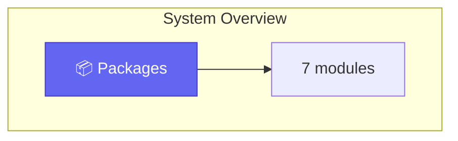
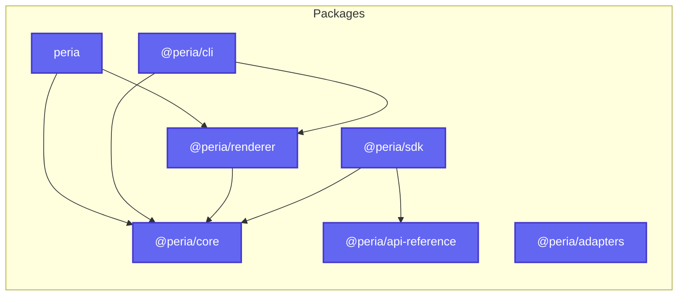
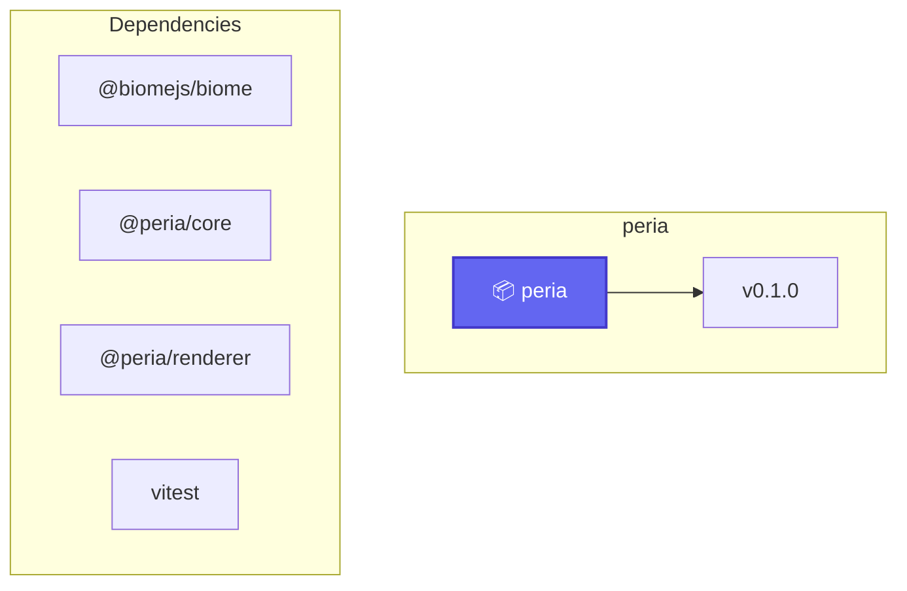
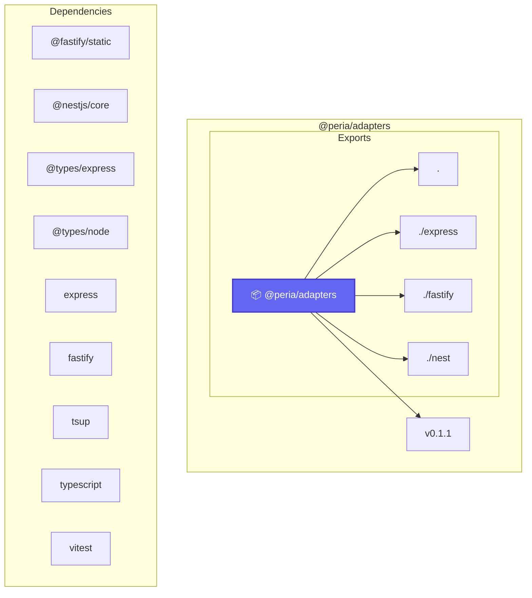
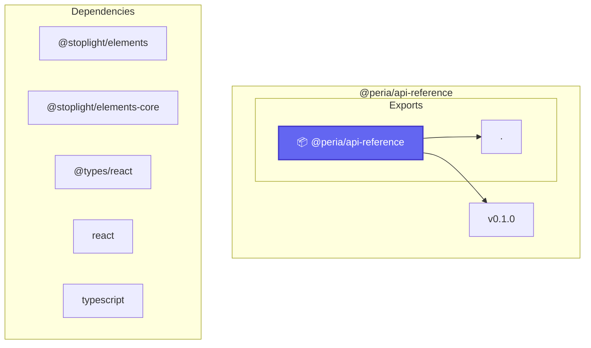

# Diagrams

These Mermaid diagrams are generated during `peria build` with the same Mermaid engine used by `peria diagram`.

Generated at: 2026-06-29T14:51:23.922Z

## Coverage

| Diagram type | Count |
| --- | --- |
| `route-flow` | 1 |
| `module-graph` | 1 |
| `package-deps` | 4 |
| `schema` | 0 |
| `endpoint-handler` | 0 |

## System Overview

- ID: `diagram-route-flow-system-overview`
- Type: `route-flow`
- Confidence: high
- Source entities: [package:peria](/docs/packages), [package:@peria/adapters](/docs/packages), [package:@peria/api-reference](/docs/packages), [package:@peria/cli](/docs/packages), [package:@peria/core](/docs/packages), [package:@peria/renderer](/docs/packages), [package:@peria/sdk](/docs/packages)
- Markdown artifact: `.peria/diagrams/route-flow/diagram-route-flow-system-overview.md`
- Mermaid source: `.peria/diagrams/route-flow/diagram-route-flow-system-overview.mmd`

## Package Dependencies: Overview

- ID: `diagram-package-deps-overview`
- Type: `package-deps`
- Confidence: high
- Source entities: [package:peria](/docs/packages), [package:@peria/adapters](/docs/packages), [package:@peria/api-reference](/docs/packages), [package:@peria/cli](/docs/packages), [package:@peria/core](/docs/packages), [package:@peria/renderer](/docs/packages), [package:@peria/sdk](/docs/packages)
- Markdown artifact: `.peria/diagrams/package-deps/diagram-package-deps-overview.md`
- Mermaid source: `.peria/diagrams/package-deps/diagram-package-deps-overview.mmd`

## Package Dependencies: peria

- ID: `diagram-package-deps-peria`
- Type: `package-deps`
- Confidence: high
- Source entities: [package:peria](/docs/packages)
- Markdown artifact: `.peria/diagrams/package-deps/diagram-package-deps-peria.md`
- Mermaid source: `.peria/diagrams/package-deps/diagram-package-deps-peria.mmd`

## Package Dependencies: @peria/adapters

- ID: `diagram-package-deps--peria-adapters`
- Type: `package-deps`
- Confidence: high
- Source entities: [package:@peria/adapters](/docs/packages)
- Markdown artifact: `.peria/diagrams/package-deps/diagram-package-deps--peria-adapters.md`
- Mermaid source: `.peria/diagrams/package-deps/diagram-package-deps--peria-adapters.mmd`

## Package Dependencies: @peria/api-reference

- ID: `diagram-package-deps--peria-api-reference`
- Type: `package-deps`
- Confidence: high
- Source entities: [package:@peria/api-reference](/docs/packages)
- Markdown artifact: `.peria/diagrams/package-deps/diagram-package-deps--peria-api-reference.md`
- Mermaid source: `.peria/diagrams/package-deps/diagram-package-deps--peria-api-reference.mmd`

## Module Graph: Overview

- ID: `diagram-module-graph-overview`
- Type: `module-graph`
- Confidence: high
- Source entities: [source:packages/adapters/src/__tests__/smoke.test.ts](/docs/modules), [source:packages/adapters/src/express.ts](/docs/modules), [source:packages/adapters/src/fastify.ts](/docs/modules), [source:packages/adapters/src/index.ts](/docs/modules), [source:packages/adapters/src/nest.ts](/docs/modules), [source:packages/adapters/src/shared.ts](/docs/modules), [source:packages/api-reference/src/index.ts](/docs/modules), [source:packages/api-reference/src/types/stoplight.d.ts](/docs/modules), [source:packages/cli/src/__tests__/integration.test.ts](/docs/modules), [source:packages/cli/src/__tests__/smoke.test.ts](/docs/modules), and 30 more
- Markdown artifact: `.peria/diagrams/module-graph/diagram-module-graph-overview.md`
- Mermaid source: `.peria/diagrams/module-graph/diagram-module-graph-overview.mmd`

```mermaid
graph LR
    subgraph "Packages"
        pkg__peria_adapters["@peria/adapters"]
        style pkg__peria_adapters fill:#6366f1,stroke:#4338ca,color:#fff
        pkg__peria_api_reference["@peria/api-reference"]
        style pkg__peria_api_reference fill:#6366f1,stroke:#4338ca,color:#fff
        pkg__peria_cli["@peria/cli"]
        style pkg__peria_cli fill:#6366f1,stroke:#4338ca,color:#fff
        pkg__peria_core["@peria/core"]
        style pkg__peria_core fill:#6366f1,stroke:#4338ca,color:#fff
    end
    subgraph "Modules"
        mod_packages_adapters_src___tests___smoke_test_ts["__tests__/smoke.test.ts"]
        pkg__peria_adapters --> mod_packages_adapters_src___tests___smoke_test_ts
        mod_packages_adapters_src_express_ts["src/express.ts"]
        pkg__peria_adapters --> mod_packages_adapters_src_express_ts
        mod_packages_adapters_src_fastify_ts["src/fastify.ts"]
        pkg__peria_adapters --> mod_packages_adapters_src_fastify_ts
        mod_packages_adapters_src_index_ts["src/index.ts"]
        pkg__peria_adapters --> mod_packages_adapters_src_index_ts
        mod_packages_adapters_src_nest_ts["src/nest.ts"]
        pkg__peria_adapters --> mod_packages_adapters_src_nest_ts
        mod_packages_adapters_src_shared_ts["src/shared.ts"]
        pkg__peria_adapters --> mod_packages_adapters_src_shared_ts
        mod_packages_api_reference_src_index_ts["src/index.ts"]
        pkg__peria_api_reference --> mod_packages_api_reference_src_index_ts
        mod_packages_api_reference_src_types_stoplight_d_ts["types/stoplight.d.ts"]
        pkg__peria_api_reference --> mod_packages_api_reference_src_types_stoplight_d_ts
        mod_packages_cli_src___tests___integration_test_ts["__tests__/integration.test.ts"]
        pkg__peria_cli --> mod_packages_cli_src___tests___integration_test_ts
        mod_packages_cli_src___tests___smoke_test_ts["__tests__/smoke.test.ts"]
        pkg__peria_cli --> mod_packages_cli_src___tests___smoke_test_ts
        mod_packages_cli_src_commands_build_ts["commands/build.ts"]
        pkg__peria_cli --> mod_packages_cli_src_commands_build_ts
        mod_packages_cli_src_commands_check_ts["commands/check.ts"]
        pkg__peria_cli --> mod_packages_cli_src_commands_check_ts
        mod_packages_cli_src_commands_context_ts["commands/context.ts"]
        pkg__peria_cli --> mod_packages_cli_src_commands_context_ts
        mod_packages_cli_src_commands_diagram_ts["commands/diagram.ts"]
        pkg__peria_cli --> mod_packages_cli_src_commands_diagram_ts
        mod_packages_cli_src_commands_init_ts["commands/init.ts"]
        pkg__peria_cli --> mod_packages_cli_src_commands_init_ts
        mod_packages_cli_src_commands_scan_ts["commands/scan.ts"]
        pkg__peria_cli --> mod_packages_cli_src_commands_scan_ts
        mod_packages_cli_src_commands_serve_ts["commands/serve.ts"]
        pkg__peria_cli --> mod_packages_cli_src_commands_serve_ts
        mod_packages_cli_src_generators_config_ts["generators/config.ts"]
        pkg__peria_cli --> mod_packages_cli_src_generators_config_ts
        mod_packages_cli_src_index_ts["src/index.ts"]
        pkg__peria_cli --> mod_packages_cli_src_index_ts
        mod_packages_cli_src_prompts_entrypoint_ts["prompts/entrypoint.ts"]
        pkg__peria_cli --> mod_packages_cli_src_prompts_entrypoint_ts
        mod_packages_cli_src_prompts_features_ts["prompts/features.ts"]
        pkg__peria_cli --> mod_packages_cli_src_prompts_features_ts
        mod_packages_cli_src_prompts_framework_ts["prompts/framework.ts"]
        pkg__peria_cli --> mod_packages_cli_src_prompts_framework_ts
        mod_packages_cli_src_prompts_route_ts["prompts/route.ts"]
        pkg__peria_cli --> mod_packages_cli_src_prompts_route_ts
        mod_packages_cli_src_utils_logger_ts["utils/logger.ts"]
        pkg__peria_cli --> mod_packages_cli_src_utils_logger_ts
        mod_packages_cli_src_utils_manifest_ts["utils/manifest.ts"]
        pkg__peria_cli --> mod_packages_cli_src_utils_manifest_ts
        mod_packages_core_fixtures_nestjs_api_src_app_module_ts["src/app.module.ts"]
        pkg__peria_core --> mod_packages_core_fixtures_nestjs_api_src_app_module_ts
        mod_packages_core_fixtures_nestjs_api_src_main_ts["src/main.ts"]
        pkg__peria_core --> mod_packages_core_fixtures_nestjs_api_src_main_ts
        mod_packages_core_fixtures_nestjs_api_src_users_dto_approve_user_request_dto_ts["dto/approve-user-request.dto.ts"]
        pkg__peria_core --> mod_packages_core_fixtures_nestjs_api_src_users_dto_approve_user_request_dto_ts
        mod_packages_core_fixtures_nestjs_api_src_users_users_controller_ts["users/users.controller.ts"]
        pkg__peria_core --> mod_packages_core_fixtures_nestjs_api_src_users_users_controller_ts
        mod_packages_core_fixtures_nestjs_api_src_users_users_module_ts["users/users.module.ts"]
        pkg__peria_core --> mod_packages_core_fixtures_nestjs_api_src_users_users_module_ts
        mod_packages_core_fixtures_nestjs_basic_src_app_module_ts["src/app.module.ts"]
        pkg__peria_core --> mod_packages_core_fixtures_nestjs_basic_src_app_module_ts
        mod_packages_core_fixtures_nestjs_basic_src_auth_auth_controller_ts["auth/auth.controller.ts"]
        pkg__peria_core --> mod_packages_core_fixtures_nestjs_basic_src_auth_auth_controller_ts
        mod_packages_core_fixtures_nestjs_basic_src_auth_auth_module_ts["auth/auth.module.ts"]
        pkg__peria_core --> mod_packages_core_fixtures_nestjs_basic_src_auth_auth_module_ts
        mod_packages_core_fixtures_nestjs_basic_src_auth_auth_service_ts["auth/auth.service.ts"]
        pkg__peria_core --> mod_packages_core_fixtures_nestjs_basic_src_auth_auth_service_ts
        mod_packages_core_fixtures_nestjs_basic_src_auth_guards_jwt_auth_guard_ts["guards/jwt-auth.guard.ts"]
        pkg__peria_core --> mod_packages_core_fixtures_nestjs_basic_src_auth_guards_jwt_auth_guard_ts
        mod_packages_core_fixtures_nestjs_basic_src_main_ts["src/main.ts"]
        pkg__peria_core --> mod_packages_core_fixtures_nestjs_basic_src_main_ts
        mod_packages_core_fixtures_nestjs_basic_src_users_dto_create_user_dto_ts["dto/create-user.dto.ts"]
        pkg__peria_core --> mod_packages_core_fixtures_nestjs_basic_src_users_dto_create_user_dto_ts
        mod_packages_core_fixtures_nestjs_basic_src_users_dto_update_user_dto_ts["dto/update-user.dto.ts"]
        pkg__peria_core --> mod_packages_core_fixtures_nestjs_basic_src_users_dto_update_user_dto_ts
        mod_packages_core_fixtures_nestjs_basic_src_users_users_controller_ts["users/users.controller.ts"]
        pkg__peria_core --> mod_packages_core_fixtures_nestjs_basic_src_users_users_controller_ts
        mod_packages_core_fixtures_nestjs_basic_src_users_users_module_ts["users/users.module.ts"]
        pkg__peria_core --> mod_packages_core_fixtures_nestjs_basic_src_users_users_module_ts
    end
    mod_packages_cli_src_commands_build_ts -. imports .-> pkg__peria_core
    mod_packages_cli_src_commands_check_ts -. imports .-> pkg__peria_core
    mod_packages_cli_src_commands_context_ts -. imports .-> pkg__peria_core
    mod_packages_cli_src_commands_diagram_ts -. imports .-> pkg__peria_core
    mod_packages_cli_src_commands_init_ts -. imports .-> pkg__peria_core
    mod_packages_cli_src_commands_scan_ts -. imports .-> pkg__peria_core
    mod_packages_cli_src_commands_serve_ts -. imports .-> pkg__peria_core
    mod_packages_cli_src_prompts_entrypoint_ts -. imports .-> pkg__peria_core
    mod_packages_cli_src_prompts_framework_ts -. imports .-> pkg__peria_core
    mod_packages_cli_src_prompts_route_ts -. imports .-> pkg__peria_core
    mod_packages_cli_src_utils_manifest_ts -. imports .-> pkg__peria_core
```

## Sources

- `.peria/diagrams/metadata.json`
- `packages/core/src/mermaid`
