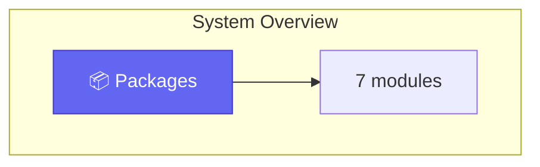
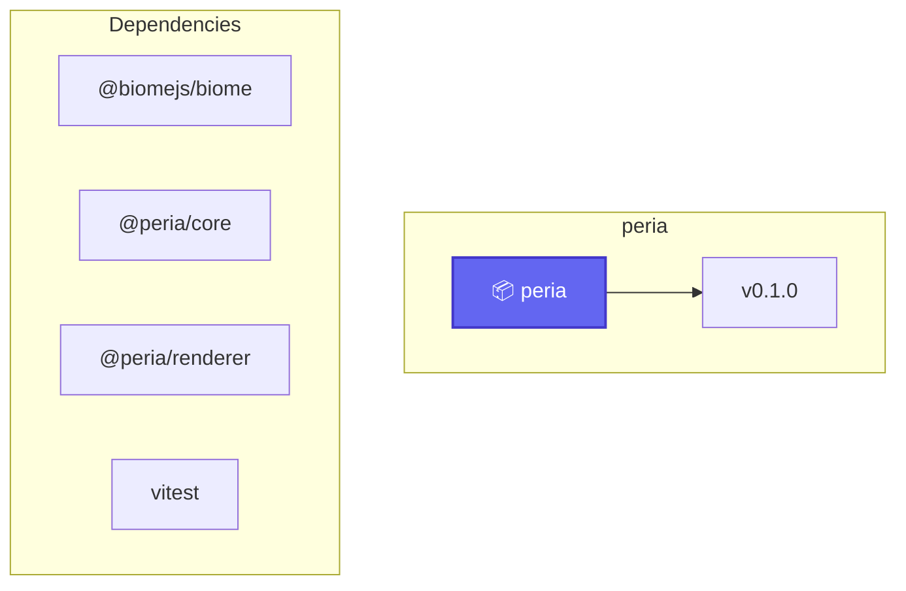
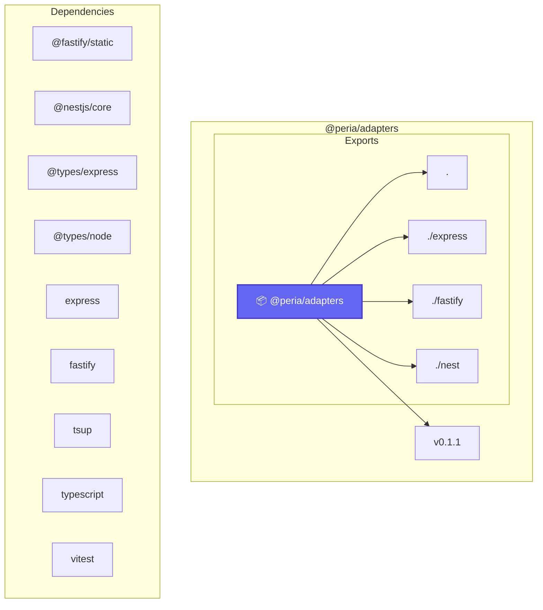
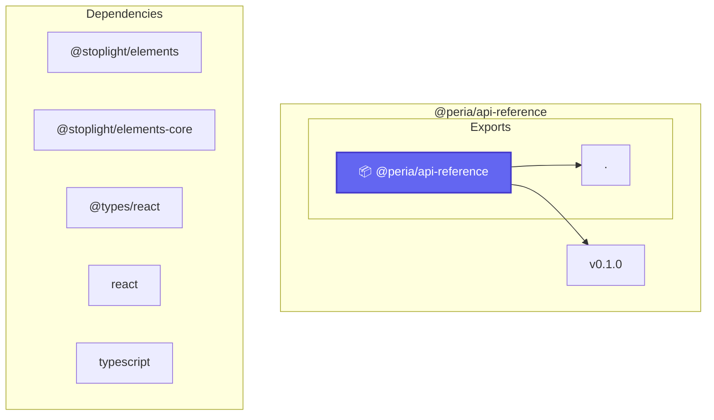

# Diagrams

These Mermaid diagrams are generated during `peria build` with the same Mermaid engine used by `peria diagram`.

Generated at: 2026-06-29T14:07:09.335Z

## Coverage

| Diagram type | Count |
| --- | --- |
| `route-flow` | 1 |
| `module-graph` | 0 |
| `package-deps` | 4 |
| `schema` | 0 |
| `endpoint-handler` | 0 |

## System Overview

- ID: `diagram-route-flow-system-overview`
- Type: `route-flow`
- Confidence: high
- Source entities: 7
- Artifact: `.peria/diagrams/route-flow/diagram-route-flow-system-overview.md`

## Package Dependencies: Overview

- ID: `diagram-package-deps-overview`
- Type: `package-deps`
- Confidence: high
- Source entities: 7
- Artifact: `.peria/diagrams/package-deps/diagram-package-deps-overview.md`

## Package Dependencies: peria

- ID: `diagram-package-deps-peria`
- Type: `package-deps`
- Confidence: high
- Source entities: 1
- Artifact: `.peria/diagrams/package-deps/diagram-package-deps-peria.md`

## Package Dependencies: @peria/adapters

- ID: `diagram-package-deps--peria-adapters`
- Type: `package-deps`
- Confidence: high
- Source entities: 1
- Artifact: `.peria/diagrams/package-deps/diagram-package-deps--peria-adapters.md`

## Package Dependencies: @peria/api-reference

- ID: `diagram-package-deps--peria-api-reference`
- Type: `package-deps`
- Confidence: high
- Source entities: 1
- Artifact: `.peria/diagrams/package-deps/diagram-package-deps--peria-api-reference.md`

## Sources

- `.peria/diagrams/metadata.json`
- `packages/core/src/mermaid`
