# GitHub Map

This page is generated from `.peria/github.json`. It is cache-first: Peria can render local commit provenance, roadmap milestones, drift issues, and inferred relations before any live GitHub synchronization exists.

## Repository

- Repository: peria
- Current branch: `feat/planning`
- Default branch: `unknown`
- Generated at: 2026-06-29T21:34:30.646Z

## Coverage

| Entity | Count |
| --- | --- |
| Issues | 30 |
| Pull requests | 0 |
| Milestones | 8 |
| Commits | 20 |
| Relations | 121 |

## Relationship Diagram

```mermaid
flowchart LR
  repo["peria"]
  repo --> commits["Commits"]
  repo --> prs["Pull Requests"]
  repo --> issues["Issues"]
  repo --> milestones["Milestones"]
  source_0["package:@peria/renderer-preview..."]
  target_0["commit:6e3e5b5b63e6992e799f9088..."]
  source_0 -->|entity_changed_by_commit| target_0
  source_1["file:packages/renderer/app-temp..."]
  target_1["commit:6e3e5b5b63e6992e799f9088..."]
  source_1 -->|entity_changed_by_commit| target_1
  source_2["file:packages/renderer/src/fuma..."]
  target_2["commit:31abbba56bd71e94fc01484a..."]
  source_2 -->|entity_changed_by_commit| target_2
  source_3["file:packages/cli/src/commands/..."]
  target_3["commit:ba78017310c1e1f6c411f366..."]
  source_3 -->|entity_changed_by_commit| target_3
  source_4["file:packages/cli/src/commands/..."]
  target_4["commit:83ee5701cdc5707f27128de2..."]
  source_4 -->|entity_changed_by_commit| target_4
  source_5["package:@peria/renderer"]
  target_5["commit:7715d31622bba7db8f0dd313..."]
  source_5 -->|entity_changed_by_commit| target_5
  source_6["file:packages/renderer/tsup.con..."]
  target_6["commit:7715d31622bba7db8f0dd313..."]
  source_6 -->|entity_changed_by_commit| target_6
  source_7["package:@peria/renderer-preview..."]
  target_7["commit:b15170c420bbfd5af0ac8567..."]
  source_7 -->|entity_changed_by_commit| target_7
  source_8["file:packages/renderer/app-temp..."]
  target_8["commit:b15170c420bbfd5af0ac8567..."]
  source_8 -->|entity_changed_by_commit| target_8
  source_9["file:packages/renderer/app-temp..."]
  target_9["commit:b15170c420bbfd5af0ac8567..."]
  source_9 -->|entity_changed_by_commit| target_9
  source_10["file:packages/renderer/app-temp..."]
  target_10["commit:b15170c420bbfd5af0ac8567..."]
  source_10 -->|entity_changed_by_commit| target_10
  source_11["file:packages/renderer/app-temp..."]
  target_11["commit:b15170c420bbfd5af0ac8567..."]
  source_11 -->|entity_changed_by_commit| target_11
  source_12["file:packages/renderer/src/prev..."]
  target_12["commit:b15170c420bbfd5af0ac8567..."]
  source_12 -->|entity_changed_by_commit| target_12
  source_13["file:packages/cli/src/commands/..."]
  target_13["commit:27958d077464e7329413e5a0..."]
  source_13 -->|entity_changed_by_commit| target_13
  source_14["file:packages/cli/src/index.ts"]
  target_14["commit:27958d077464e7329413e5a0..."]
  source_14 -->|entity_changed_by_commit| target_14
  source_15["file:packages/core/src/github/i..."]
  target_15["commit:3e377d3ee903ce68bde60b93..."]
  source_15 -->|entity_changed_by_commit| target_15
  source_16["file:packages/core/src/github/m..."]
  target_16["commit:3e377d3ee903ce68bde60b93..."]
  source_16 -->|entity_changed_by_commit| target_16
  source_17["file:packages/core/src/index.ts"]
  target_17["commit:3e377d3ee903ce68bde60b93..."]
  source_17 -->|entity_changed_by_commit| target_17
  source_18["doc:README.md"]
  target_18["commit:67ac65b8416ffe0e096598a0..."]
  source_18 -->|entity_changed_by_commit| target_18
  source_19["file:packages/cli/src/commands/..."]
  target_19["commit:67ac65b8416ffe0e096598a0..."]
  source_19 -->|entity_changed_by_commit| target_19
  source_20["file:packages/cli/src/commands/..."]
  target_20["commit:67ac65b8416ffe0e096598a0..."]
  source_20 -->|entity_changed_by_commit| target_20
  source_21["file:packages/cli/src/index.ts"]
  target_21["commit:67ac65b8416ffe0e096598a0..."]
  source_21 -->|entity_changed_by_commit| target_21
  source_22["file:packages/core/src/github/i..."]
  target_22["commit:67ac65b8416ffe0e096598a0..."]
  source_22 -->|entity_changed_by_commit| target_22
  source_23["file:packages/core/src/github/i..."]
  target_23["commit:67ac65b8416ffe0e096598a0..."]
  source_23 -->|entity_changed_by_commit| target_23
  source_24["file:packages/core/src/github/t..."]
  target_24["commit:67ac65b8416ffe0e096598a0..."]
  source_24 -->|entity_changed_by_commit| target_24
  source_25["file:packages/core/src/index.ts"]
  target_25["commit:67ac65b8416ffe0e096598a0..."]
  source_25 -->|entity_changed_by_commit| target_25
  source_26["doc:README.md"]
  target_26["commit:7e7434c5b7ea284a221fd726..."]
  source_26 -->|entity_changed_by_commit| target_26
  source_27["file:packages/cli/src/commands/..."]
  target_27["commit:7e7434c5b7ea284a221fd726..."]
  source_27 -->|entity_changed_by_commit| target_27
  source_28["file:packages/cli/src/commands/..."]
  target_28["commit:7e7434c5b7ea284a221fd726..."]
  source_28 -->|entity_changed_by_commit| target_28
  source_29["file:packages/core/src/github/c..."]
  target_29["commit:7e7434c5b7ea284a221fd726..."]
  source_29 -->|entity_changed_by_commit| target_29
  source_30["file:packages/core/src/github/i..."]
  target_30["commit:7e7434c5b7ea284a221fd726..."]
  source_30 -->|entity_changed_by_commit| target_30
  source_31["file:packages/core/src/github/r..."]
  target_31["commit:7e7434c5b7ea284a221fd726..."]
  source_31 -->|entity_changed_by_commit| target_31
  source_32["file:packages/core/src/github/t..."]
  target_32["commit:7e7434c5b7ea284a221fd726..."]
  source_32 -->|entity_changed_by_commit| target_32
  source_33["file:packages/core/src/index.ts"]
  target_33["commit:7e7434c5b7ea284a221fd726..."]
  source_33 -->|entity_changed_by_commit| target_33
  source_34["file:packages/core/src/scanner/..."]
  target_34["commit:7e7434c5b7ea284a221fd726..."]
  source_34 -->|entity_changed_by_commit| target_34
  source_35["file:packages/core/src/scanner/..."]
  target_35["commit:7e7434c5b7ea284a221fd726..."]
  source_35 -->|entity_changed_by_commit| target_35
  source_36["file:packages/core/src/types/gr..."]
  target_36["commit:7e7434c5b7ea284a221fd726..."]
  source_36 -->|entity_changed_by_commit| target_36
  source_37["file:packages/core/src/types/ma..."]
  target_37["commit:7e7434c5b7ea284a221fd726..."]
  source_37 -->|entity_changed_by_commit| target_37
  source_38["file:packages/core/src/wiki/col..."]
  target_38["commit:7e7434c5b7ea284a221fd726..."]
  source_38 -->|entity_changed_by_commit| target_38
  source_39["doc:README.md"]
  target_39["commit:22d7d9c47d831a1803b8e754..."]
  source_39 -->|entity_changed_by_commit| target_39
```

## Relation Types

| Relation | Count |
| --- | --- |
| `entity_changed_by_commit` | 91 |
| `issue_belongs_to_milestone` | 30 |

## Milestones

| Milestone | Title | State | Issues | Done | Open | Blocked | PRs | Commits |
| --- | --- | --- | --- | --- | --- | --- | --- | --- |
| #0 | Higiene de release e verdade pública | open | 4 | 3 | 1 | 0 | 0 | 0 |
| #1 | Renderer Fumadocs de verdade | open | 5 | 0 | 5 | 0 | 0 | 0 |
| #2 | Mais conteúdo, diagramas e mapa da aplicação | open | 3 | 1 | 2 | 0 | 0 | 0 |
| #3 | Dogfood real em Peria | open | 3 | 0 | 3 | 0 | 0 | 0 |
| #4 | Adapters e dogfood NestJS | closed | 3 | 3 | 0 | 0 | 0 | 0 |
| #5 | GitHub auth, issues, milestones e sincronização | open | 6 | 2 | 3 | 1 | 0 | 0 |
| #6 | Usabilidade e DX | open | 3 | 1 | 2 | 0 | 0 | 0 |
| #7 | Preparação para adoção pública | open | 3 | 2 | 1 | 0 | 0 | 0 |

## Pull Requests

_No entries found._

## Issues

| Issue | Title | State | Labels | Milestone | Source |
| --- | --- | --- | --- | --- | --- |
| #10001 | T0.1 Reconciliar versões locais com npm | closed | `peria`, `roadmap`, `status:done` | #0 | `TASKS.md` |
| #10002 | T0.2 Corrigir documentação pública que promete mais do que existe | closed | `peria`, `roadmap`, `status:done` | #0 | `TASKS.md` |
| #10003 | T0.3 Limpar artefatos acidentais do repositório | closed | `peria`, `roadmap`, `status:done` | #0 | `TASKS.md` |
| #10004 | T0.4 Fresh install real com pacotes publicados | open | `peria`, `roadmap`, `status:open` | #0 | `TASKS.md` |
| #10101 | T1.1 Decidir arquitetura do renderer | open | `peria`, `roadmap`, `status:open` | #1 | `TASKS.md` |
| #10102 | T1.2 Criar modo Fumadocs mínimo | open | `peria`, `roadmap`, `status:open` | #1 | `TASKS.md` |
| #10103 | T1.5 Embutir app TanStack Start + Fumadocs e ligar `peria serve` | open | `peria`, `roadmap`, `status:open` | #1 | `TASKS.md` |
| #10104 | T1.3 Melhorar UX da documentação gerada | open | `peria`, `roadmap`, `status:open` | #1 | `TASKS.md` |
| #10105 | T1.4 Busca e navegação | open | `peria`, `roadmap`, `status:open` | #1 | `TASKS.md` |
| #10201 | T2.1 Incorporar Mermaid no build principal | open | `peria`, `roadmap`, `status:open` | #2 | `TASKS.md` |
| #10202 | T2.2 Criar application map | closed | `peria`, `roadmap`, `status:done` | #2 | `TASKS.md` |
| #10203 | T2.3 Melhorar qualidade das claims | open | `peria`, `roadmap`, `status:open` | #2 | `TASKS.md` |
| #10301 | T3.1 Dogfood usando npm, não workspace | open | `peria`, `roadmap`, `status:open` | #3 | `TASKS.md` |
| #10302 | T3.2 Publicar os docs dogfoodados | open | `peria`, `roadmap`, `status:open` | #3 | `TASKS.md` |
| #10303 | T3.3 Usar a wiki para guiar desenvolvimento | open | `peria`, `roadmap`, `status:open` | #3 | `TASKS.md` |
| #10401 | T4.1 Revalidar pacote `@peria/adapters` | closed | `peria`, `roadmap`, `status:done` | #4 | `TASKS.md` |
| #10402 | T4.2 Dogfood em NestJS | closed | `peria`, `roadmap`, `status:done` | #4 | `TASKS.md` |
| #10403 | T4.3 Decidir futuro do SDK | closed | `peria`, `roadmap`, `status:done` | #4 | `TASKS.md` |
| #10501 | T5.1 Definir escopo do GitHub sync | open | `peria`, `roadmap`, `status:open` | #5 | `TASKS.md` |
| #10502 | T5.2 Autenticação GitHub | closed | `peria`, `roadmap`, `status:done` | #5 | `TASKS.md` |
| #10503 | T5.3 Modelo de dados GitHub | closed | `peria`, `roadmap`, `status:done` | #5 | `TASKS.md` |
| #10504 | T5.4 Criar issues a partir de drift | open | `peria`, `roadmap`, `status:open` | #5 | `TASKS.md` |
| #10505 | T5.5 Milestones e organização de tarefas | open | `peria`, `roadmap`, `status:blocked` | #5 | `TASKS.md` |
| #10506 | T5.6 Logs de commits melhores | open | `peria`, `roadmap`, `status:open` | #5 | `TASKS.md` |
| #10601 | T6.1 Melhorar `peria init` | open | `peria`, `roadmap`, `status:open` | #6 | `TASKS.md` |
| #10602 | T6.2 Melhorar mensagens de erro | open | `peria`, `roadmap`, `status:open` | #6 | `TASKS.md` |
| #10603 | T6.3 CI de qualidade | closed | `peria`, `roadmap`, `status:done` | #6 | `TASKS.md` |
| #10701 | T7.1 README orientado a uso real | closed | `peria`, `roadmap`, `status:done` | #7 | `TASKS.md` |
| #10702 | T7.2 Exemplo end-to-end | closed | `peria`, `roadmap`, `status:done` | #7 | `TASKS.md` |
| #10703 | T7.3 Release notes e changelog | open | `peria`, `roadmap`, `status:open` | #7 | `TASKS.md` |

## Recent Commits

| Commit | Date | Author | Issues | Files | Subject |
| --- | --- | --- | --- | --- | --- |
| `6e3e5b5` | 2026-06-29T15:54:00-03:00 | Gabriel Bezerra Rodrigues | none | 4 | feat(renderer): render Mermaid diagrams in preview app |
| `18e9c5e` | 2026-06-29T15:46:44-03:00 | Gabriel Bezerra Rodrigues | none | 29 | chore(docs): regenerate wiki artifacts |
| `c23ceab` | 2026-06-29T15:45:59-03:00 | Gabriel Bezerra Rodrigues | none | 2 | docs: update TASKS and PUBLISHING for preview app |
| `591a8b2` | 2026-06-29T15:45:57-03:00 | Gabriel Bezerra Rodrigues | none | 1 | test(cli): drop removed artifact assertions |
| `31abbba` | 2026-06-29T15:45:55-03:00 | Gabriel Bezerra Rodrigues | none | 1 | fix(renderer): drop emitted source.config/lib/source and duplicate h1 |
| `ba78017` | 2026-06-29T15:45:53-03:00 | Gabriel Bezerra Rodrigues | none | 1 | fix(cli): clean source.config.ts and lib/ from old builds |
| `83ee570` | 2026-06-29T15:45:51-03:00 | Gabriel Bezerra Rodrigues | none | 1 | feat(cli): rewrite serve to spawn preview app |
| `7715d31` | 2026-06-29T15:45:49-03:00 | Gabriel Bezerra Rodrigues | none | 2 | feat(renderer): support ./preview subpath export |
| `b15170c` | 2026-06-29T15:45:47-03:00 | Gabriel Bezerra Rodrigues | none | 13 | feat(renderer): add TanStack Start + Fumadocs preview app |
| `27958d0` | 2026-06-29T15:45:46-03:00 | Gabriel Bezerra Rodrigues | none | 2 | feat(cli): add milestones sync command |
| `3e377d3` | 2026-06-29T15:45:43-03:00 | Gabriel Bezerra Rodrigues | none | 4 | feat(core): add roadmap milestone sync |
| `67ac65b` | 2026-06-29T12:38:12-03:00 | Gabriel Bezerra Rodrigues | none | 37 | feat(github): draft drift issues from checks |
| `7e7434c` | 2026-06-29T12:25:20-03:00 | Gabriel Bezerra Rodrigues | none | 37 | feat(github): add provenance cache model |
| `22d7d9c` | 2026-06-29T12:12:02-03:00 | Gabriel Bezerra Rodrigues | none | 28 | feat(github): add auth diagnostics |
| `f98a3f1` | 2026-06-29T12:06:06-03:00 | Gabriel Bezerra Rodrigues | none | 31 | chore(sdk): defer public sdk contract |
| `7e52595` | 2026-06-29T12:02:48-03:00 | Gabriel Bezerra Rodrigues | none | 31 | test(adapters): dogfood nestjs adapter |
| `cf0d489` | 2026-06-29T11:51:49-03:00 | Gabriel Bezerra Rodrigues | none | 31 | fix(adapters): serve fumadocs docs artifacts |
| `b9e8d6c` | 2026-06-29T11:25:27-03:00 | Gabriel Bezerra Rodrigues | none | 20 | test(dogfood): add npm cli validation |
| `131eeea` | 2026-06-29T11:21:55-03:00 | Gabriel Bezerra Rodrigues | none | 40 | feat(wiki): add navigation maps and search index |
| `0be7c0b` | 2026-06-29T11:08:05-03:00 | Gabriel Bezerra Rodrigues | none | 67 | feat(docs): switch wiki build to fumadocs output |
