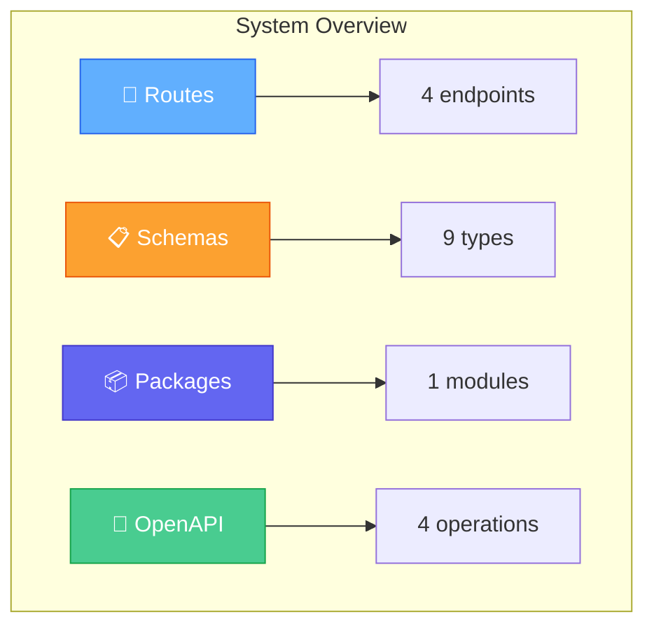
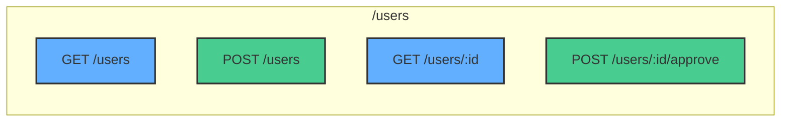
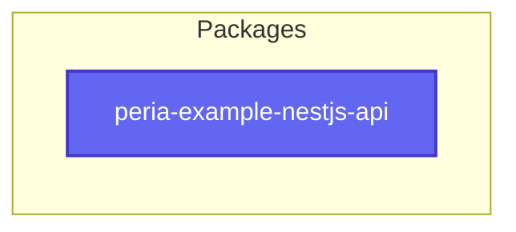
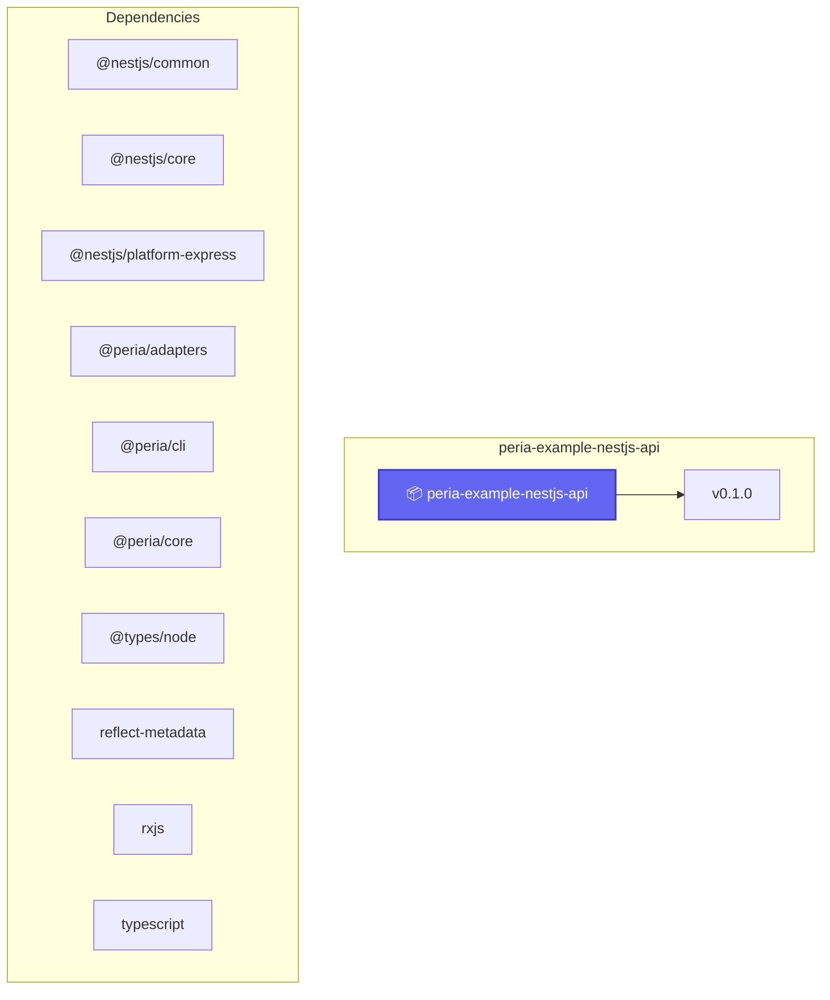
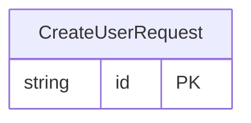
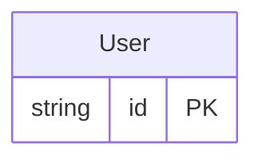
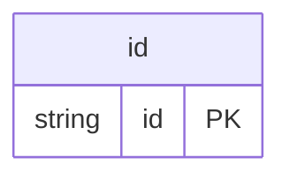
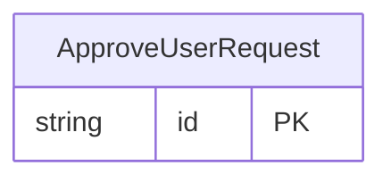

# Diagrams

These Mermaid diagrams are generated during `peria build` with the same Mermaid engine used by `peria diagram`.

Generated at: 2026-06-29T21:28:14.907Z

## Coverage

| Diagram type | Count |
| --- | --- |
| `route-flow` | 2 |
| `module-graph` | 0 |
| `package-deps` | 2 |
| `schema` | 6 |
| `endpoint-handler` | 0 |

## System Overview

- ID: `diagram-route-flow-system-overview`
- Type: `route-flow`
- Confidence: high
- Source entities: [route:GET:/users](/docs/application-map), [route:POST:/users](/docs/application-map), [route:GET:/users/:id](/docs/application-map), [route:POST:/users/:id/approve](/docs/application-map), [schema:CreateUserRequest](/docs/application-map), [schema:User](/docs/application-map), [schema:User](/docs/application-map), `param:op:getUserById:id`, [schema:ApproveUserRequest](/docs/application-map), [schema:User](/docs/application-map), and 4 more
- Markdown artifact: `.peria/diagrams/route-flow/diagram-route-flow-system-overview.md`
- Mermaid source: `.peria/diagrams/route-flow/diagram-route-flow-system-overview.mmd`



## Route Flow: /users

- ID: `diagram-route-flow--users`
- Type: `route-flow`
- Confidence: high
- Source entities: [route:GET:/users](/docs/application-map), [route:POST:/users](/docs/application-map), [route:GET:/users/:id](/docs/application-map), [route:POST:/users/:id/approve](/docs/application-map)
- Markdown artifact: `.peria/diagrams/route-flow/diagram-route-flow--users.md`
- Mermaid source: `.peria/diagrams/route-flow/diagram-route-flow--users.mmd`



## Package Dependencies: Overview

- ID: `diagram-package-deps-overview`
- Type: `package-deps`
- Confidence: high
- Source entities: [package:peria-example-nestjs-api](/docs/packages)
- Markdown artifact: `.peria/diagrams/package-deps/diagram-package-deps-overview.md`
- Mermaid source: `.peria/diagrams/package-deps/diagram-package-deps-overview.mmd`



## Package Dependencies: peria-example-nestjs-api

- ID: `diagram-package-deps-peria-example-nestjs-api`
- Type: `package-deps`
- Confidence: high
- Source entities: [package:peria-example-nestjs-api](/docs/packages)
- Markdown artifact: `.peria/diagrams/package-deps/diagram-package-deps-peria-example-nestjs-api.md`
- Mermaid source: `.peria/diagrams/package-deps/diagram-package-deps-peria-example-nestjs-api.mmd`



## Schema Diagram: Overview

- ID: `diagram-schema-overview`
- Type: `schema`
- Confidence: high
- Source entities: [schema:CreateUserRequest](/docs/application-map), [schema:User](/docs/application-map), [schema:User](/docs/application-map), `param:op:getUserById:id`, [schema:ApproveUserRequest](/docs/application-map), [schema:User](/docs/application-map), `param:op:approveUser:id`, [schema:CreateUserDto](/docs/application-map), [schema:ApproveUserRequestDto](/docs/application-map)
- Markdown artifact: `.peria/diagrams/schema/diagram-schema-overview.md`
- Mermaid source: `.peria/diagrams/schema/diagram-schema-overview.mmd`

```mermaid
erDiagram
    CreateUserRequest {
        string id PK
    }
    User {
        string id PK
    }
    User {
        string id PK
    }
    id {
        string id PK
    }
    ApproveUserRequest {
        string id PK
    }
    User {
        string id PK
    }
    id {
        string id PK
    }
    CreateUserDto {
        string id PK
        string email NOT NULL
        string name NOT NULL
    }
    ApproveUserRequestDto {
        string id PK
        string approvedAt NOT NULL
        string approvedBy NULL
    }
```

## Schema Diagram: CreateUserRequest

- ID: `diagram-schema-CreateUserRequest`
- Type: `schema`
- Confidence: high
- Source entities: [schema:CreateUserRequest](/docs/application-map)
- Markdown artifact: `.peria/diagrams/schema/diagram-schema-CreateUserRequest.md`
- Mermaid source: `.peria/diagrams/schema/diagram-schema-CreateUserRequest.mmd`



## Schema Diagram: User

- ID: `diagram-schema-User`
- Type: `schema`
- Confidence: high
- Source entities: [schema:User](/docs/application-map)
- Markdown artifact: `.peria/diagrams/schema/diagram-schema-User.md`
- Mermaid source: `.peria/diagrams/schema/diagram-schema-User.mmd`



## Schema Diagram: User

- ID: `diagram-schema-User`
- Type: `schema`
- Confidence: high
- Source entities: [schema:User](/docs/application-map)
- Markdown artifact: `.peria/diagrams/schema/diagram-schema-User.md`
- Mermaid source: `.peria/diagrams/schema/diagram-schema-User.mmd`


## Schema Diagram: id

- ID: `diagram-schema-id`
- Type: `schema`
- Confidence: high
- Source entities: `param:op:getUserById:id`
- Markdown artifact: `.peria/diagrams/schema/diagram-schema-id.md`
- Mermaid source: `.peria/diagrams/schema/diagram-schema-id.mmd`



## Schema Diagram: ApproveUserRequest

- ID: `diagram-schema-ApproveUserRequest`
- Type: `schema`
- Confidence: high
- Source entities: [schema:ApproveUserRequest](/docs/application-map)
- Markdown artifact: `.peria/diagrams/schema/diagram-schema-ApproveUserRequest.md`
- Mermaid source: `.peria/diagrams/schema/diagram-schema-ApproveUserRequest.mmd`


